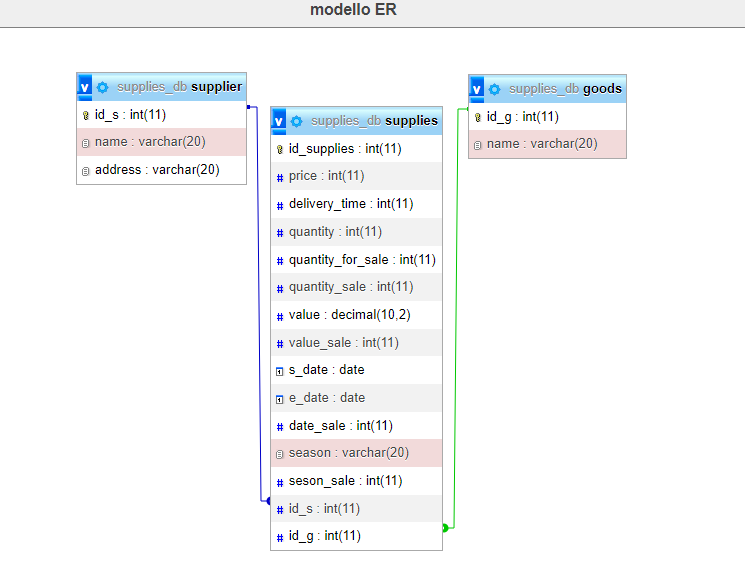

# **Supplies-interface**
> This web app allows a store to interface with a list of suppliers for the purchase of goods so that it can decide on the best offer based on its requests.

---
## **Functional analysis**
### **NARRATIVA**

Come dipendente del negozio, voglio un sistema in grado di trovare il miglior fornitore di un prodotto dato il prezzo di acquisto e gli eventuali sconti applicabili, in modo da poter acquistare merce dal fornitore più conveniente. Inoltre, voglio visualizzare i tempi di spedizione minimi di ogni fornitore per poter scegliere anche in base alla velocità di consegna.

### **ACCEPTANCE CRITERIA**

1. **Scenario**: Nessun fornitore vende il prodotto richiesto
+ **Dato**: che il negozio non ha ancora acquistato il prodotto.
+ **Quando** cerco un fornitore per il prodotto desiderato
+ **Allora** il sistema deve restituire un messaggio di errore indicando che il prodotto non è disponibile
2. **Scenario**: Almeno un fornitore vende il prodotto richiesto
+ **Dato** che il negozio ha specificato il prodotto da acquistare e la quantità desiderata
+ **Quando** cerco i fornitori che vendono il prodotto richiesto
+ **Allora** il sistema deve restituire una lista di fornitori che vendono il prodotto richiesto, indicando il prezzo di acquisto e il tempo di spedizione di ciascun fornitore
3. **Scenario**: Nessun fornitore offre uno sconto per l'ordine richiesto
+ **Dato** che il negozio ha specificato il prodotto da acquistare e la quantità desiderata, e non c'è alcuno sconto disponibile
+ **Quando** cerco i fornitori che vendono il prodotto richiesto
+ **Allora** il sistema deve restituire la lista di fornitori come descritto nel precedente scenario
4. **Scenario**: Almeno un fornitore offre uno sconto per l'ordine richiesto
+ **Dato** che il negozio ha specificato il prodotto da acquistare e la quantità desiderata, e ci sono sconti disponibili
+ **Quando** cerco i fornitori che vendono il prodotto richiesto
+ **Allora** il sistema deve restituire una lista di fornitori che vendono il prodotto richiesto, indicando il prezzo di acquisto e il tempo di spedizione di ciascun fornitore, inclusi gli sconti applicabili
5. **Scenario**: Un fornitore offre uno sconto solo per un periodo limitato
+ **Dato** che il negozio ha specificato il prodotto da acquistare e la quantità desiderata, e un fornitore offre uno sconto solo per un periodo limitato
+ **Quando** cerco i fornitori che vendono il prodotto richiesto
+ **Allora** il sistema deve restituire una lista di fornitori che vendono il prodotto richiesto, indicando il prezzo di acquisto e il tempo di spedizione di ciascun fornitore, inclusi gli sconti applicabili solo per il periodo indicato
6. **Scenario**: Un fornitore offre uno sconto solo per un certo quantitativo minimo di prodotto
+ **Dato** che il negozio ha specificato il prodotto da acquistare e una certa quantità minima richiesta per ottenere lo sconto offerto da un fornitore.
+ **Quando** cerco i fornitori che vendono il prodotto richiesto
+ **Allora** il sistema deve restituire una lista di fornitori che vendono il prodotto richiesto, indicando il prezzo di acquisto e il tempo di spedizione di ciascun fornitore, inclusi gli sconti applicabili solo se la quantità minima richiesta è raggiunta.
## **Tecnologies**
This app is divided between:
+ Frontend
+ Backend
+ Database
### **Frontend**
Developed using the svelte Kit framework.
### **Backend**
Developed with python using the flask framework.
## **Database**
This project includes a database to manage information about suppliers and supplies they offer. The database consists of three tables: ***'goods'***, ***'supplier'***, and ***'supplies'***.

### **Goods table**
The ***'goods'*** table represents a list of supplies and has the following attributes:

+ ***'id_g'***: unique identifier for the supply
+ ***'name'***: name of the supply
### **Supplier table**
The Ssupplier table represents a list of available suppliers and has the following attributes:

+ ***'id_s'***: unique identifier for the supplier
+ ***'name'***: name of the supplier
+ ***'address'***: address of the supplier
### **Supplies table**
The ***'supplies'*** table represents the supplies available for each supplier and has the following attributes:

+ ***'id_supplies'***: unique identifier for the supply of a supplier
+ ***'price'***: price of the product sold by the supplier
+ ***'delivery_time'***: time required for delivery of the product
+ ***'quantity'***: quantity of the supply available for sale
+ ***'quantity_for_sale'***: minimum quantity of the supply to be purchased to apply a discount
+ ***'quantity_sale'***: discount applied if the supply is purchased in quantities greater than those indicated in quantity_for_sale
+ ***'value'***: total purchase value required to apply a discount
+ ***'value_sale'***: discount applied if the total purchase value exceeds the value indicated in value
+ ***'s_date'*** and ***'e_date'***: start and end date for applying a discount, if the selected date is between these dates, a discount is applied
+ ***'date_sale'***: discount applicable if the selected date is between s_date and e_date
+ ***'season'***: season for which a discount is applied
+ ***'season_sale'***: discount applied if the selected date falls within the season indicated in season
### **Relationships**

The ***'supplier'*** and ***'supplies'*** tables are linked by a one-to-many relationship, as a supplier can have multiple supplies. Similarly, the ***'goods'*** and ***'supplies'*** tables are linked by a one-to-many relationship, as a supply corresponds to one material. The foreign keys for these relationships are ***'supplier.id_s'*** and ***'goods.id_g'***, respectively.
### **Modello ER**

### **Logical model**
+ **Supplier** (***'id_s'*** `PK`, 'name', 'address');
+ **Goods** (***'id_g'*** `PK`, 'name');
+ **Supplies** (***'id_supplies'*** PK, ***'id_s'*** `FK`, ***'id_g'*** `FK`, 'price', 'delivery_time', 'quantity', 'quantity_for_sale', 'quantity_sale', 'value', 'value_sale', 's_date', 'e_date', 'date_sale', 'season', 'season_sale');
